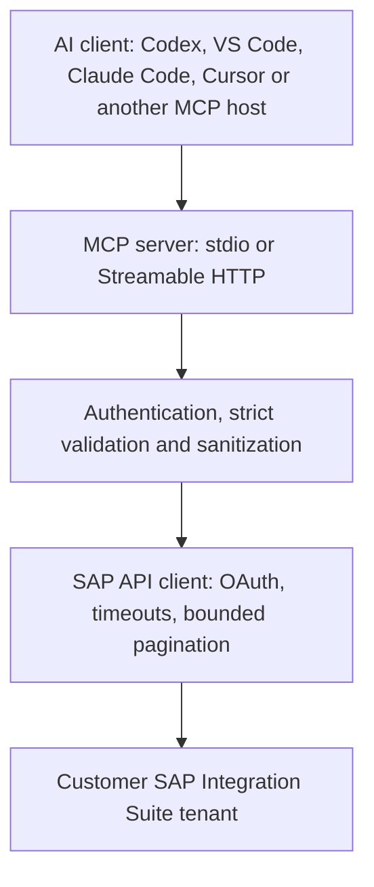

# sap-integration-suite-mcp


Open-source MCP server for SAP Integration Suite monitoring, failed-message analysis, integration health and AI-assisted troubleshooting.

This is an independent open-source project and is not an official SAP product.

**Checkout validation:** dependency installation was blocked by this execution environment. The full test suite and build have not passed here, and the supplied empty lockfile must be regenerated before CI or Docker use. See [validation status and release checklist](docs/VALIDATION.md).

Self-host the server in your environment and connect your MCP-compatible AI client. The server retrieves read-only monitoring metadata from your own SAP Integration Suite / SAP Cloud Integration tenant. Your chosen client performs inference; this server never calls an LLM.

## Architecture



## Features

- Vendor-independent MCP SDK v2 server with stdio and stateless Streamable HTTP.
- OAuth 2.0 client credentials, in-memory token reuse and refresh.
- Normalized OData message metadata and sanitized diagnostic evidence.
- Deterministic error categories and health statistics without AI calls.
- Strict inputs, safe URL construction, bounded results and read-only SAP access.
- Mocked test suite, CI workflow and non-root Docker deployment.

## Supported tools

| Tool                           | Inputs                                                                                | Result                                                                                   |
| ------------------------------ | ------------------------------------------------------------------------------------- | ---------------------------------------------------------------------------------------- |
| `get_failed_messages`          | Optional startTime, endTime, integrationFlow, package, limit                          | Failed metadata; package filter returns an unsupported error                             |
| `search_messages`              | Optional status, integrationFlow, startTime, endTime, correlationId, messageId, limit | Normalized messages and truncation flag                                                  |
| `get_message_details`          | messageId                                                                             | Message processing log metadata                                                          |
| `get_error_details`            | messageId                                                                             | Sanitized error text and deterministic classification, or unavailable result             |
| `get_iflow_status`             | integrationFlow                                                                       | Runtime artifact status, or unavailable result                                           |
| `get_recent_failures`          | minutes (default 60), optional integrationFlow, limit                                 | Failed messages within a calculated UTC window                                           |
| `summarize_integration_health` | Optional startTime, endTime                                                           | Counts, percentages, failure ranking and sample scope                                    |
| `analyze_failure`              | messageId                                                                             | Message, timestamps, runtime status, diagnostics, classification and investigation areas |

Limits default to 100, maximum 500. Recent windows are 1–10080 minutes. Times must be ISO 8601 with timezone; time windows filter message start time. Health defaults to the past 24 hours and caps retrieval at 500 messages. Inspect `truncated` and `scope`: a bounded sample is not a tenant-wide total. Unknown statuses are counted as `other`; empty windows return zero percentages. Error categories are unavailable in bulk health because this adapter does not fetch per-message diagnostic text in that operation.

The classifier supports AUTHENTICATION, AUTHORIZATION, HTTP_4XX, HTTP_5XX, TIMEOUT, CONNECTIVITY, SFTP, CERTIFICATE, MAPPING, TRANSFORMATION, PAYLOAD_VALIDATION, RATE_LIMIT, OAUTH and UNKNOWN. Confidence is conservative and evidence contains deterministic indicators. Investigation suggestions are not proven root causes.

Version 1 does not deploy flows, change configuration, delete messages, restart processing or retry messages. Business payloads, attachments and custom message headers are not retrieved. Endpoint/adapter metadata is explicitly unavailable in analysis. Runtime status and error navigation depend on the tenant API and permissions.

## Security and privacy

Credentials stay in your runtime environment. There is no external database, author-operated backend, telemetry upload or LLM call. The server does not send SAP monitoring data to the project author. The MCP client receives results and may transmit them according to its own data-handling rules.

SAP URLs come only from trusted server configuration, use HTTPS and reject redirects. MCP callers cannot choose hosts or request arbitrary URLs. Pagination is confined to the same message collection. Logs contain only operation metadata on stderr. Secrets, access tokens, authorization headers and SAP bodies are excluded from logs. Diagnostic text is redacted and capped; free-form business information can still remain, so treat outputs as sensitive.

HTTP checks exact Host and Origin allowlists and supports a separate bearer credential. Non-loopback binds require a token. Put production access behind an authenticated TLS gateway with rate limits and concurrency controls. See [security design](docs/SECURITY.md) and [reporting policy](SECURITY.md).

## Prerequisites and SAP configuration

Use Node.js 24 LTS, npm, your SAP tenant's HTTPS management API URL, and a least-privilege OAuth technical client. Confirm API permissions and token endpoint with your SAP administrator. Exact role collections and scopes vary; see [SAP setup](docs/SAP_SETUP.md), [SAP monitoring API](https://api.sap.com/api/MessageProcessingLogs/overview) and [official SAP documentation](https://help.sap.com/docs/integration-suite).

| Variable                          | Meaning / default                                                             |
| --------------------------------- | ----------------------------------------------------------------------------- |
| SAP_BASE_URL                      | Tenant origin or `/api/v1` root; required HTTPS                               |
| SAP_TOKEN_URL                     | OAuth token endpoint; required HTTPS                                          |
| SAP_CLIENT_ID / SAP_CLIENT_SECRET | Required technical-client credentials                                         |
| SAP_AUTH_MODE                     | `oauth2` only                                                                 |
| SAP_REQUEST_TIMEOUT_MS            | Per-request timeout, default 30000, range 100–120000                          |
| MCP_PORT / MCP_HOST               | 3000 / 127.0.0.1                                                              |
| MCP_HTTP_TOKEN                    | Independent MCP bearer token; at least 32 characters for remote binds         |
| MCP_ALLOWED_HOSTS                 | Comma-separated exact Host authorities; default localhost:3000,127.0.0.1:3000 |
| MCP_ALLOWED_ORIGINS               | Comma-separated exact Origin URLs; default rejects browser Origins            |
| LOG_LEVEL                         | debug, info, warn, error or silent; default info                              |

The built-in logger emits operation information at info/debug and suppresses it at warn/error/silent. Startup failures use a generic stderr error. Health reports process liveness, not credential validity or SAP connectivity.

## Installation

From a checkout of this repository:

```sh
npm install
npm run build
```

Supply environment variables through your secret manager or protected process environment. `.env.example` contains names only. To use a local `.env` file, copy the example, set your own values and restrict its permissions. Node's explicit `--env-file` flag can load it; the application does not load it automatically.

```sh
node --env-file=.env dist/index.js --stdio
```

No credentials are required to run tests. Once the lockfile is generated and committed, contributors and CI should use `npm ci`.

## Local stdio

Point any stdio-capable MCP host at:

```json
{
  "command": "node",
  "args": ["/absolute/path/sap-integration-suite-mcp/dist/index.js", "--stdio"]
}
```

Forward SAP variables securely from the host's process environment. For a protected local file, use `args: ["--env-file=/absolute/path/.env", "/absolute/path/dist/index.js", "--stdio"]`. Do not embed secrets in shared configuration. Claude Code, Cursor and other stdio clients have different enclosing config formats. ChatGPT connectivity depends on the product's supported MCP/connector mechanism.

## Streamable HTTP

```sh
node --env-file=.env dist/index.js --http
```

The endpoint is `http://127.0.0.1:3000/mcp`. POST/GET are delegated to the current SDK transport; stateless legacy clients receive 405 for GET/DELETE session operations. This is Streamable HTTP, not a separate deprecated HTTP+SSE endpoint. `GET /health` returns small JSON and uses the same access guards.

For remote access configure `MCP_HOST`, a high-entropy `MCP_HTTP_TOKEN`, exact allowed Host authorities and any browser Origin URLs. Serve `https://your-host.example.com/mcp` through your TLS gateway. Never send the SAP OAuth secret to the MCP client. The MCP access token is separate. No inbound OAuth authorization server is provided.

## Codex

```sh
codex mcp add sapIntegrationSuite -- node /absolute/path/sap-integration-suite-mcp/dist/index.js --stdio
codex mcp add sapIntegrationSuite --url https://your-host.example.com/mcp
```

Use one transport for a given server name. Configure forwarded environment variables for stdio or `bearer_token_env_var` for remote access. See [Codex setup](docs/CODEX_SETUP.md) and [official OpenAI MCP documentation](https://developers.openai.com/codex/mcp).

## VS Code

Remote `.vscode/mcp.json` configuration uses a `servers` entry with `type: "http"`, the `/mcp` URL and a securely prompted Authorization header. See the complete [VS Code example](docs/VSCODE_SETUP.md).

## Docker

```sh
docker compose up --build -d
```

Supply a protected `.env` containing your own SAP variables and a separate `MCP_HTTP_TOKEN` of at least 32 characters. Compose passes it at runtime; `.dockerignore` excludes all `.env` files from the image. For managed production deployments use your platform's secret injection rather than a checked-in file. Docker runs the HTTP server as the node user with a read-only filesystem. Compose publishes only loopback by default. Extend networking through your authenticated TLS gateway.

## Example questions

- “Show failed SAP Integration Suite messages from the last hour.”
- “Show failures for SALESFORCE_TO_S4 today.”
- “Get details for message ID ABC123.”
- “Summarize Integration Suite health for the past 24 hours.”
- “Analyze the available diagnostic evidence for message ABC123.”

Use your intended timezone when asking about “today”; tools require explicit ISO times. ABC123 is a synthetic example.

## Troubleshooting

| Symptom                          | Action                                                                                                     |
| -------------------------------- | ---------------------------------------------------------------------------------------------------------- |
| Startup failed                   | Check required environment fields and HTTPS URLs; `.env` is not automatically loaded                       |
| OAuth failure                    | Verify token URL, client credentials and `client_secret_basic` support with your administrator             |
| SAP 403                          | Verify read permissions against current SAP documentation                                                  |
| Runtime/error result unavailable | Confirm API resource, message/artifact ID and tenant availability                                          |
| HTTP 401/403                     | Check the separate MCP token, exact Host authority and allowed Origin                                      |
| Timeout                          | Check network/proxy reachability; set server and client timeouts appropriately                             |
| Empty failure list               | Verify time window, retention and the tenant status vocabulary (`FAILED` versus API-specific alternatives) |
| Sample health statistics         | Narrow the window; inspect `truncated` rather than interpreting it as total tenant health                  |

API assumptions and required tenant checks are documented in [SAP_SETUP.md](docs/SAP_SETUP.md). Do not post production logs or credentials when reporting issues.

## Development and contributing

```sh
npm run dev:stdio
npm run dev:http
npm run format
npm run lint
npm run typecheck
npm test
npm run test:coverage
npm run build
```

See [CONTRIBUTING.md](CONTRIBUTING.md), [architecture](docs/ARCHITECTURE.md) and [code of conduct](CODE_OF_CONDUCT.md). Add your actual GitHub Actions status badge after choosing the repository URL. Enable private vulnerability reporting before release.

## Roadmap

- Verify adapters against multiple real tenant configurations and supported SAP API revisions.
- Add tenant-validated error and runtime fixtures, broader health aggregation and optional policy enforcement.
- Add additional supported authentication providers and customer-controlled audit integrations.
- Keep Version 1 read-only; any future write capabilities require separate security design and explicit scope.

Recommended repository topics: `sap`, `sap-integration-suite`, `sap-cloud-integration`, `sap-cpi`, `mcp`, `model-context-protocol`, `enterprise-integration`, `integration`, `ai`, `typescript`, `open-source`, `observability`, `monitoring`.

## License and author

Apache License 2.0 — see [LICENSE](LICENSE). Cite the project using [CITATION.cff](CITATION.cff).

**Rameshkumar Varanganti**
