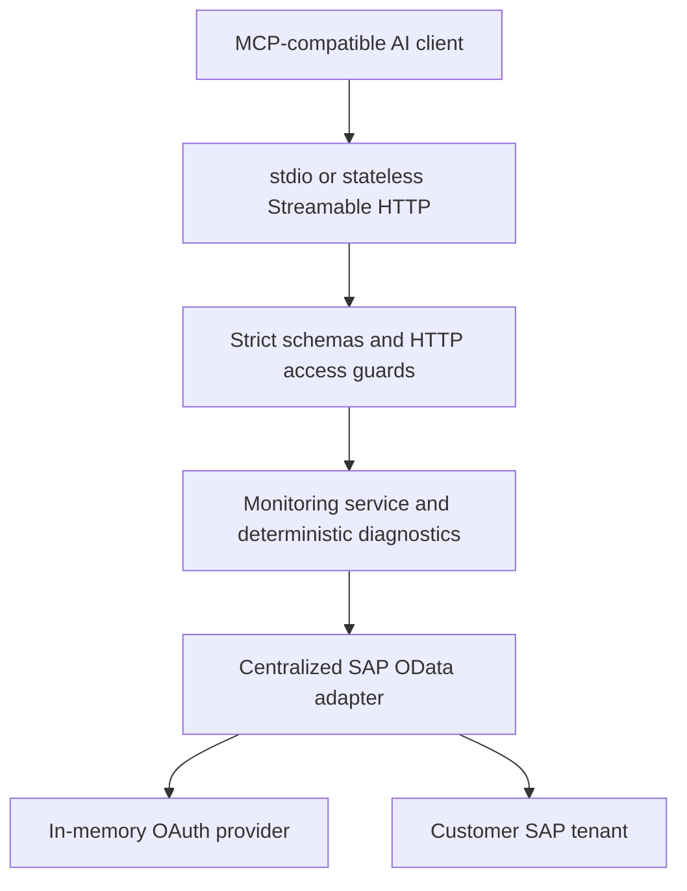

# Architecture

The MCP layer registers eight read-only tools with Zod v4 input schemas and tool annotations. It returns normalized structured content and a JSON text representation. There is no model dependency, sampling, filesystem tool, shell tool, proxy tool or dynamic execution.

The SAP adapter owns endpoint paths, OData query construction and normalization. `SAPIntegrationSuiteClient` permits only GET monitoring requests and confines requests to the configured HTTPS tenant service root. OAuth's token endpoint is separately configured by the server administrator. Future authentication mechanisms can implement `AuthenticationProvider` without changing monitoring code.

Requests validate inputs, acquire a cached token, generate a correlation ID, fetch with timeout and redirect rejection, enforce a response size cap, normalize errors and select allowed metadata fields. Transient 429/502/503/504 and connectivity failures have bounded retries; 401 invalidates the rejected token once. Concurrent token acquisition is coalesced. Credentials and tokens stay in process memory.

Tool calls validate before contacting SAP, call the service, and return structured evidence. SAP bodies and headers never enter the logger. Diagnostic text is sanitized and limited to 4096 characters. Error classification maps recognizable patterns to investigation areas without claiming causality. Metadata and diagnostics are untrusted data, including possible prompt-injection text.

HTTP uses the SDK v2 factory to create a fresh server for each request. Token caching is shared; no client session store or database is needed. `GET /health` reports process health, not SAP connectivity. Access guards check exact Host and Origin allowlists; non-loopback binds require a separate bearer token. A customer's authenticated TLS gateway should enforce identity, authorization, rate limits and concurrency limits before internet access. Each deployment serves one configured tenant and one access domain; it is not a multi-tenant authorization service.

Security boundaries are: client to MCP transport, validated tool to monitoring service, configured adapter to SAP, and SAP data to normalized tool output. Pagination must stay on the message collection and configured origin. Business payloads, attachments and custom headers are never fetched.

A future policy-governance layer may add per-user tenant permissions, audit export, flow allowlists and retention policy. Any future write capability needs explicit design, separate permissions and release review; the current server contains no such operation.
